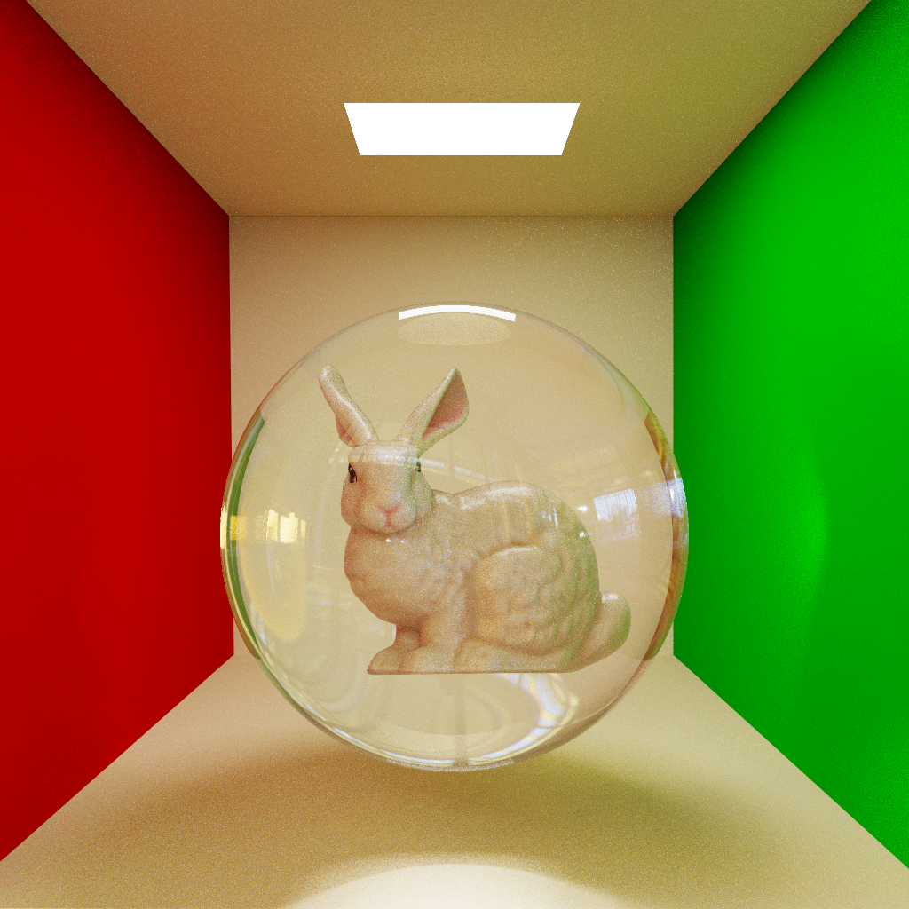
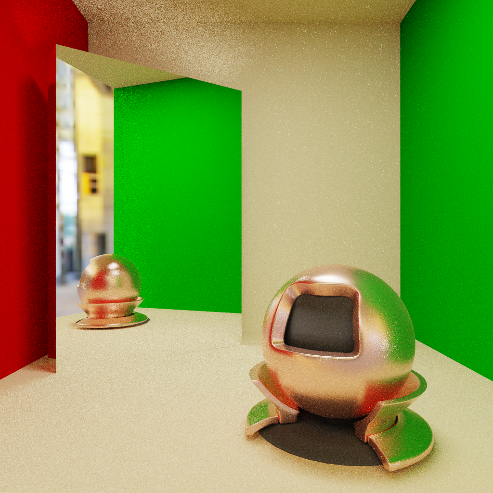

CUDA Path Tracer
================

## Features
- **Wavefront Path Tracing**
  - **Separating mega-kernels into several kernels**: `RayGen`, `Intersection`, `Shade` ...
  - **Less Warp Divergence**: Stream compacting the ray path segments 
  - **Improve Memory Access Coalescing**: SoA data layout and sorting path segments by material type before shading
  
- **Texture Mapping**: More surface color based on CUDA `Texture Object`

- **Triangle Primitive Mesh**: More shapes based on `Obj` loader 

- **Accelerate Data Structure** `BVH`: 
  - Binary Radix Tree Construction
  - Parallel Tree Traversal
  - Two Level Acceleration Structures: world level (TLAS) & model level (BLAS)
  
- **Efficient Monte Carlo Integrator**: 
  - **Next Event Estimation**: Shadow rays are explicitly aimed at light sources
  - **Multiple Importance Sampling**: Combining the PDFs of different sampling techniques
  
- **Physically Based Rendering**: 
  
  - Diffuse (Lambertian)
  - Dielectric
  - Conductor
  - Plastic
  
  Kulla Conty approximation for multi-scattering is implemented for Dielectrics and Conductors
  
- **Denoiser**

## Screenshots

## Dependencies

- **CUDA**
- **OpenGL**
- **GLFW**
- **GLEW**
- **GLM**
- **ImGui**
- **Stb Image**
- **Tinygltf Loader**
- **Tinyobj loader**
- **nlohmann-json**

# Reference
- [CIS 5650 GPU Programming and Architecture](https://cis5650-fall-2024.github.io/)
- [Physically Based Rendering V4](https://www.pbr-book.org/4ed/contents)
- [GPU-Raytracer (Open Source Code)](https://github.com/jan-van-bergen/GPU-Raytracer)

